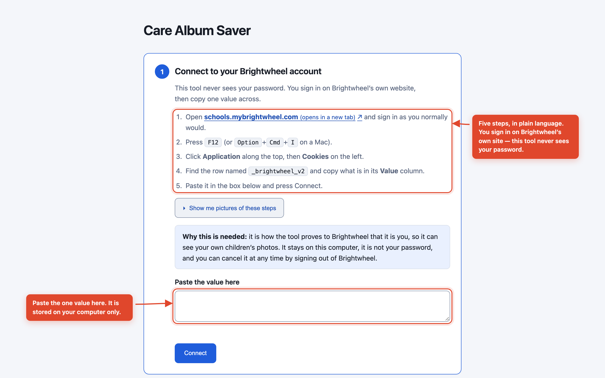

# Care Album Saver

**Save your own child's photos from Brightwheel onto your own computer, sorted into a folder for each week.**

Your nursery posts photos of your child to Brightwheel, and there they stay: on
Brightwheel's servers, saved one at a time from the website, and reachable only for as long
as your family's access to that profile lasts. When a child leaves, so does the album.

This tool copies all of them onto your own computer, into a folder for each week. The files
arrive carrying nothing — no date, no name, nothing a photo app can sort by — so it writes
in the time each one was posted, your child's name and the teacher's note, and leaves a
plain-text `.json` beside every file so the archive still reads in twenty years without
this tool. Run it once a day and it only fetches what is new.

What you end up with is yours, on your disk, and it outlives the account.

```
Care Album Photos/
├── archive.json           ← the tool's list of what it has already saved
├── Robin Maple/
│   ├── 2026-W37/          ← 7–13 September 2026
│   │   ├── 2026-09-09_084512_a1b2c3d4.jpg
│   │   ├── 2026-09-09_084512_a1b2c3d4.jpg.json
│   │   └── README.md
│   └── 2026-W38/
└── Sam Maple/
```

---

## Privacy and security

**This is the most important section in this file. It is written for everyone, not just
for programmers.**

### Where do my child's photos go?

Two places, and only two places:

1. **Brightwheel's service**, where they already are.
2. **The computer you run this on**, in the folder you choose.

That's it. There is no third place. There is no website to sign up to, no online account,
and no company behind it. Nothing is uploaded anywhere. Nobody — including the people who
wrote this — can see your photos, your child's name, or which nursery they go to.

One honest clarification, because the word matters: the setup page *does* run a small web
server, but it runs **on your own computer**, only while the program is open, and only your
computer can reach it. It is not on the internet.

### Can anyone else see them?

| | |
|---|---|
| **Does this tool send my photos anywhere?** | No. They go from Brightwheel straight to your computer. |
| **Does it collect usage data or analytics?** | No. It talks to Brightwheel's API and to the photo links Brightwheel hands back, and to nothing else. |
| **Can the authors see anything?** | No. Nothing is sent to us; there is no service to send it to. |
| **Can other parents see my child's photos?** | No. Brightwheel only ever shows this tool the children on *your* account. |
| **Can I archive someone else's child?** | No. This is not a limitation we added — it is how Brightwheel works. Your login only reaches your own family. |

### What about my password?

**This tool never asks for and never sees your Brightwheel password.** There is no box for
it anywhere — not on the setup page, not in the terminal, not behind an option you could
turn on by mistake.

You sign in on Brightwheel's own website, exactly as you always do, including the
6-digit code they text or email you. Then you copy one value — a "session", which is
like a temporary ticket that says "this person is already signed in" — and paste it in.

That session is stored **on your computer only**, in your private settings folder, in a
file only your user account can open. It is never sent anywhere except back to
Brightwheel.

Copying that value out of your browser is fiddlier than typing a password would be, and
that is a trade we made on purpose: getting into the habit of typing your real password
into other people's software is a bad habit to build, even when the software is honest.

### The setup page that opens in your browser

When you run the setup assistant, it prints a link starting `127.0.0.1` for you to paste into your browser. That
number means **this computer and nothing else**. The page is not on the internet. Nobody
on your wifi, in your building, or anywhere in the world can open it. It closes when you
stop the program.

### What this tool cannot protect you from

Honesty matters more here than reassurance, so:

- **If someone can use your computer, they can see the photos.** They are ordinary files
  in an ordinary folder. Use a password on your computer.
- **If you save into a cloud-synced folder** — iCloud Drive, Dropbox, OneDrive, Google
  Drive — then that service will copy every photo to their servers. On a Mac, Desktop and
  Documents are often synced to iCloud without you turning it on. The default location
  (`~/Care Album Photos`) avoids this, but if you change it, check where you are pointing.
- **Photos may contain other children.** A group photo from your child's class has other
  families' children in it. Please treat those photos the way you would want yours treated.
- **Labelling photos with names writes those names into the file itself.** Your child's
  name, the nursery's name, the name of whoever posted the photo, and the teacher's note —
  which usually names all three in one sentence. That is what makes them searchable in
  Apple Photos and similar apps, but it also means those names travel with the file if you
  ever share it. You can turn this off with one switch, and then nothing inside the file
  says who or where. Everything is still recorded in the small `.json` file beside each
  photo, which stays behind when you share the photo itself.
- **Removing location information needs ExifTool.** If you have not installed it, every
  photo is still saved and everything is still written to the `.json` file beside it — but
  nothing can be changed inside the photo, so any coordinates it arrived with are still
  there. The run says so rather than leaving you to assume otherwise.
- **On Windows, the files are not owner-only.** On a Mac or Linux this tool writes the
  session file so that only your account can open it, and creates the photo folders the
  same way. Windows has no equivalent file setting: the session and the photos inherit the
  permissions of the folder they are in. For `%APPDATA%` that already keeps other standard
  accounts on the PC out, but it is weaker than what a Mac or Linux gets, and it is not
  something this tool can fix.

### For people who fork this project

If you clone or fork this repository to modify it, you might reasonably worry about
committing your own session by accident and publishing it. The project is built so that
this is hard:

- **Your session is never stored in the project folder.** It lives in your operating
  system's settings folder — `~/Library/Application Support/care-album-saver` on a Mac,
  `~/.config/care-album-saver` on Linux, `%APPDATA%\care-album-saver` on Windows.
  There is nothing in the repository to commit, because nothing is there.
- **The session is an unprintable object in the code.** Printing it, logging it, or
  putting it in an error message produces `[redacted]`, not the value. You have to call
  `.expose()` on purpose.
- **`.gitignore` blocks** browser captures (`.har`), cookie files, `.env` files, session
  files and downloaded photos.
- **A secret scanner runs on every pull request** in this repository, with a custom rule
  that recognises a Brightwheel session specifically. Be aware of two real limits: GitHub's
  own built-in secret scanning does **not** know what a Brightwheel session looks like
  (custom patterns are a paid feature), and **GitHub Actions do not run in a fork** until
  the fork's owner switches them on. So treat the scanner as a helpful net, not a guarantee.
- **Everything published to npm is an allowlist** (`files` in `package.json`), so a stray
  local file cannot be included by accident. Note for contributors: never add an
  `.npmignore` — it completely overrides `.gitignore` and silently re-includes files the
  allowlist was protecting.

**If you think your session has leaked, assume you cannot delete it.** Anything pushed to a
GitHub fork stays retrievable through the upstream repository's network even after you
delete the commit or the fork — GitHub considers this expected behaviour. The only real fix
is to make the leaked session useless: sign out of Brightwheel everywhere from their
website, which invalidates it immediately. Do that first, before trying to rewrite history.

---

## Getting started

The setup assistant walks you through everything. **[Full illustrated guide →](docs/GUIDE.md)**

```sh
npx care-album-saver setup
```

Then open the link it prints. Three steps: connect your account, tick the children you want
and check the settings, then press **Start saving**. Each setting saves itself the moment
you change it, so there is nothing to remember to press, and while a run is going there is a
**Stop** button beside **Start saving**.

<p align="center">
  
</p>

Once you have connected once, you never need to again until the session expires:

```sh
npx care-album-saver run        # save any new photos
```

### Running it every day

**macOS / Linux** — add to `crontab -e`:

```
0 19 * * *  /usr/local/bin/npx care-album-saver run
```

Use the full path to `npx`, not a bare `npx`. A scheduled job looks for programs in only a
few places and usually does not find it. Type `which npx` in your terminal and paste what
it prints — with Homebrew it is often `/opt/homebrew/bin/npx`.

**Windows** — Task Scheduler needs `npx.cmd`, not `npx`.
[The guide explains both](docs/GUIDE.md#doing-it-automatically-every-day).

**Docker** — there is no published image. Nobody builds one for you, so build it yourself
from this repository. The session and the photos are mounted in, never baked into the image:

```sh
docker build -t care-album-saver .

docker run --rm \
  --user "$(id -u):$(id -g)" \
  -v ~/.config/care-album-saver:/config \
  -v ~/Brightwheel\ Photos:/photos \
  care-album-saver run --dir /photos
```

`--dir /photos` is what sends the photos to the folder you mounted. Naming a command at the
end of `docker run` replaces the one built into the image, and the built-in one is the only
place `--dir` would otherwise come from — so if you name `run`, name `--dir /photos` with
it, or the photos are written inside the container and thrown away when it exits.

On Linux, `--user` runs the container as you, so it can read the mounted session file —
which only your account can open — and write into the mounted photos folder. Without it the
container runs as its own user and can only write folders that user owns. Docker Desktop on
a Mac or Windows maps bind mounts itself, so the flag does no harm there.

`~/.config/care-album-saver` is the Linux location. On a Mac the session is in
`~/Library/Application Support/care-album-saver`. Run `care-album-saver where` to
print the exact folder to mount as `/config`.

There is also a `CARE_ALBUM_SESSION` environment variable, which the tool reads instead of
the session file when it is set. **Mount the file rather than use it.** An environment
variable is visible in process listings, lands in shell history, and is copied into crash
dumps; a mounted file is none of those things.

---

## Commands

| Command | What it does |
|---|---|
| `setup` | Open the setup assistant in your browser. Easiest way to start. |
| `login` | Paste your session in the terminal instead. |
| `run` | Save any new photos. `Ctrl` + `C` stops it after the photo it is on. |
| `children` | List the children on your account, with the id Brightwheel uses for each. |
| `doctor` | Check everything is working. It never prints your session, only a short fingerprint of it — but it does print your folder paths, which contain your computer's user name. |
| `verify` | Check that Brightwheel's API still has the shape this tool expects. Read-only: it saves no photos, and prints no names, notes or ids. |
| `where` | Show where your files and settings are kept. |

| Option | Default | |
|---|---|---|
| `--dir <path>` | `~/Care Album Photos` | Where to save |
| `--all` | off | Re-check everything, not just new photos |
| `--child <id or name>` | every child | Only this child, for this one run. Repeat it for several. |
| `--no-name-tag` | off | Do not write any name into the photo |
| `--port <n>` | chosen for you | Port for the setup assistant |
| `--base-url <url>` | Brightwheel's own | Point at a different API. Used by the tests. |

On Windows the default folder is `%USERPROFILE%\Care Album Photos`. If you set this tool up while it
was called `brightwheel-archive`, it keeps using the folder and the settings you already
have — nothing is moved or renamed on your disk, and `care-album-saver doctor` prints the
paths it is actually using. Once you have chosen a
folder in the setup page, that is the default instead.

`--child` takes either the id that `care-album-saver children` prints, or the child's
full name, where capitals do not matter. It changes one run only — the choice you made in
the setup page is not touched. `--help` prints this same list in the terminal.

---

## Stopping a run, and carrying on

Press `Ctrl` + `C` while a run is going. It finishes the photo it is saving, writes down
everything it has saved so far, and stops. The summary line then begins **Stopped.** rather
than **Done.** — for example `Stopped. 12 new, 40 already had, 0 failed.` — followed by a
line telling you to run the same command again to carry on where it left off.

Press `Ctrl` + `C` a second time and it exits on the spot. That is the harsher option:
nothing is written down, so the photo in flight is abandoned and up to a couple of dozen
files saved since the last checkpoint are fetched again next time, leaving you a second
copy of each, named `…-2.jpg`. The first `Ctrl` + `C` avoids all of that, which is why it
is worth the few seconds.

In the setup page, the **Stop** button beside **Start saving** stops a run the same way. So
does `Ctrl` + `C` in the terminal you started the setup assistant from — it stops the run
first, which means waiting for the photo in flight, and a second `Ctrl` + `C` closes
straight away.

`run` finishes with an exit code your scheduler can read: **0** when it reached the end of
the feed, and **0** when you stopped it and nothing failed — a stop you asked for is not a
failure. It is **1** when a photo failed to save.

### If a run is interrupted

A run can also end early for reasons you did not choose: your Brightwheel session expires
part-way through, the connection drops, the disk fills up. In every case:

- **Everything already saved stays saved.** The files are on disk, and before the run gives
  up it writes down that it has them — and says so plainly if it could not.
- **The next plain `run` finishes the job.** It starts again at the newest post and works
  back, recognises the photos it already has, and downloads only the rest.
- **You do not need `--all`.** That option is for re-checking an archive you think is wrong,
  not for recovering from an interruption.

A power cut or a force-quit is the one case where the tool gets no chance to write anything
down. Nothing is lost — the files are on disk — but up to a couple of dozen of them are
downloaded a second time on the next run, and you end up with a duplicate of each.

The tool only moves its "everything up to here is done" marker for a child when a run has
walked that child's whole feed with nothing left behind. An interrupted run holds the newest
photos and nothing older, so treating its newest photo as the marker would silently skip the
rest of the feed for ever. It does not.

The first `run` after upgrading from a version that had no such marker reads each child's
whole feed once. That pass downloads nothing you already have — it only reads the listing,
to work out where to carry on from — and every run after it is quick again.

---

## What gets written into each photo and video

Photo and video apps disagree about which field means "when was this taken", so this tool
writes all of the common ones. Your files land on the right day in whichever app you use.

### Photos

| Field | Holds |
|---|---|
| `EXIF:DateTimeOriginal`, `CreateDate`, `ModifyDate` | The time it was **posted** to Brightwheel, as the clock read there (see "About the dates, honestly") |
| `EXIF:OffsetTimeOriginal`, `OffsetTimeDigitized` | The timezone offset, so that local time is unambiguous |
| `IPTC:DateCreated`, `TimeCreated`, `DigitalCreationDate`, `DigitalCreationTime` | The same moment, with the offset, for older galleries |
| `XMP-photoshop:DateCreated`, `XMP-xmp:CreateDate`, `ModifyDate` | The same moment again, for Immich and web galleries |
| `XMP-iptcExt:PersonInImage` | Your child's name — only with the names switch on |
| `IPTC:Keywords`, `XMP-dc:subject` | Your child's name and `Brightwheel`, as searchable tags — only with the names switch on |
| `XMP-dc:description`, `IPTC:Caption-Abstract`, `EXIF:UserComment` | The teacher's note |
| `XMP-dc:creator` | Who posted it — only with the names switch on |
| `XMP-iptcExt:LocationCreatedSublocation` | The nursery's name, when Brightwheel gives one — only with the names switch on |

### Videos

An MP4 or MOV is a QuickTime container, and none of the EXIF fields above exist inside one.
**`DateTimeOriginal` is not written to a video**, because it is not a QuickTime tag: asking
for it anyway buries it in a block that no video app consults for the date, while the
container keeps saying whenever the file was encoded. These are the fields video apps
actually read:

| Field | Holds |
|---|---|
| `QuickTime:CreateDate`, `ModifyDate` | The time it was **posted**, written in UTC as the QuickTime specification requires |
| `QuickTime:TrackCreateDate`, `TrackModifyDate`, `MediaCreateDate`, `MediaModifyDate` | The same instant, in the track and media headers |
| `Keys:CreationDate` | The same moment as local time with its offset — the field Apple Photos prefers |
| `XMP-photoshop:DateCreated`, `XMP-xmp:CreateDate`, `ModifyDate` | The same moment again, for Immich and web galleries |
| `XMP-iptcExt:PersonInImage` | Your child's name — only with the names switch on |
| `XMP-dc:subject`, `Keys:Keywords` | Your child's name and `Brightwheel`, as searchable tags — only with the names switch on |
| `XMP-dc:description`, `Keys:Description` | The teacher's note |
| `XMP-dc:creator`, `Keys:Author` | Who posted it — only with the names switch on |
| `XMP-iptcExt:LocationCreatedSublocation` | The nursery's name, when Brightwheel gives one — only with the names switch on |

So a video's headers hold UTC while its week folder is named for the local day. Both are
right — each follows its own convention — and a player that reads the header converts it
back to the local time it was posted.

One consequence worth knowing before it surprises you: run plain `exiftool` on an archived
video and `CreateDate` reads as the UTC wall clock, with no zone beside it, which can look
hours off. Photo and video apps show the local time, because they convert it. Both are the
same instant; only the hex editor sees UTC.

**The picture itself is never altered or re-compressed.** Only the metadata is touched, so
the file you keep is the file Brightwheel served. The tests check this the hard way, on both
kinds: for a photo, the compressed scan — the part of the file that is the picture — is
compared byte for byte against what the server sent; for a video, the `mdat` box that holds
the frames is compared the same way, and — on a machine that has `ffprobe` — the rewritten
container is then read back to prove it still plays. Both checks live in
`packages/care-album-saver/test/real-media-fixtures.test.js`, in the tests named "photo
metadata round-trips…" and "video metadata round-trips…".

Every file also gets a `.json` file beside it, in plain text, so the archive is readable in
twenty years without this tool and without ExifTool. **It holds more than the photo does:**
your child's name and their Brightwheel id, the nursery's name, the teacher's note, and who
posted it — all of it, whatever the switches above are set to. That is deliberate, because
the sidecar stays behind when you share the photo. It also means the `.json` file is the one
thing in your archive you should not paste into a public bug report.

### `archive.json`

One more file sits at the top of your photos folder. `archive.json` is the tool's memory:
every file it has saved, with its size, a checksum and where it came from. That is what
makes the second run quick — a photo it recognises is never fetched twice. It also holds one
marker per child, recording how far the last complete pass through that child's feed
reached, which is where the next run starts.

Paths inside it are written with forward slashes on every platform, so an archive built on
Windows reads on a Mac or Linux and back again. Do not delete it: without it the tool has
forgotten everything and downloads the lot a second time, alongside the copies you already
have.

### About the dates, honestly

**The photos Brightwheel gives you have no information in them at all.** Not the date, not
the place, nothing — we checked, on a real account. Whatever your child's teacher's phone
recorded when it took the picture is gone by the time the photo reaches you. So if you save
a photo from the website, your computer stamps it with the moment you clicked, and a year of
them lands in your photo app in one meaningless heap.

This tool gives each photo the time it was **posted to Brightwheel**, which the app does
tell us, and writes it into the file properly. For a nursery that is usually minutes after
the picture was taken and nearly always the same day, so the photos sort correctly and land
in the right week.

What it cannot do — and we would rather say so than let you find out later — is recover the
exact moment the shutter clicked. That information does not survive the trip through
Brightwheel. An earlier version of this page claimed otherwise, on the strength of a field
name every other open-source Brightwheel client also assumes means capture time. On the one
real account this has been checked against, that field is identical to the upload time on
every record.

You can check your own account, which is the point of the tool being honest about this:

```sh
npx care-album-saver verify          # reads the API, downloads nothing
npx care-album-saver verify --deep   # also reads three photos, then deletes them
```

The second one answers "does the date survive inside the photo on *my* nursery's account?"
If it ever does, please open an issue — it would be worth supporting.

---

## How it works

Brightwheel has no public API. The website's photo feed — the one you scroll — is powered
by an internal paginated endpoint, so this tool reads that endpoint directly instead of
driving a browser and simulating scrolling. That makes it fast, reliable, and gentle on
Brightwheel's servers (one request at a time, with a pause between them).

**What has been checked, and against what.** One real account, at one nursery. A full run
on 21 September 2026 read the feed and saved 632 files, and `verify` then confirmed the
field names this tool relies on — and corrected one: the person who posted a photo is in
`first_name` and `last_name`, not `name`, so every archive written before that recorded no
author at all. There is no published documentation for the endpoint; the names were first
pieced together from six other open-source Brightwheel clients, and that is exactly why
they needed checking.

**Still unchecked**, and each of these is one more read away: whether pages count from 0 or
1, the largest page size the API allows, whether a higher-resolution original exists, and
how long a photo link stays valid. One account at one nursery is also not every nursery, so
if `verify` reports something different on yours, that is worth an issue.

`care-album-saver verify` is how you check it on your own account without archiving
anything. It makes a handful of read-only requests — a few reads of the API, and a check
that a photo link still answers — and downloads no photos. Mostly it reports which fields
are present and what type each one is: never a child's name, never a note, never an id,
never a date. A few plain values do appear, and they are listed here so that nothing in the
report comes as a surprise — how many children and how many posts it counted, whether the
two dates on a post differ and by how many minutes, the internet address photos are served
from, and the names (not the contents) of the security parameters on a photo link. None of that identifies anybody, which is why the report is safe to paste into
a bug report.

### Before you use this: Brightwheel's terms

**Please read this part properly. We are not going to pretend the question does not exist.**

Brightwheel's [Terms of Service](https://mybrightwheel.com/terms/) restrict automated
access to their service. They prohibit anyone who *"Crawls, scrapes, or spiders any page,
data, or portion of or relating to the Services or Content"* and who *"Copies or stores the
Content or any portion thereof."* This tool does automated access, and it does store
content.

We make **no claim** that using it is permitted. That is between you and Brightwheel.
Please read their terms yourself and decide. Use this at your own risk.

What we can tell you plainly:

- It only ever reads **your own account** — the photos of your own children.
- It only **reads**. It never changes or deletes anything in your Brightwheel account.
- It is deliberately gentle: one request at a time, with a pause between them. That is a
  lighter load than scrolling the website yourself.

We also want to correct something you may read elsewhere. Tools like this are sometimes
justified by data-protection "portability" rights. **That argument does not hold here.**
Brightwheel's privacy policy treats your child's photos as Customer Data that it processes
*on behalf of the school*. That makes the school the data controller and Brightwheel the
processor — and portability rights run against the controller. If you want a formal copy of
your child's data, ask the school.

> **Not affiliated with or endorsed by Brightwheel.** This is an independent tool, provided
> as-is with no warranty. Field names in an undocumented API can change without warning; if
> that happens the tool stops with a clear message rather than silently saving nothing.

### The two packages

| Package | |
|---|---|
| [`care-album-saver`](packages/care-album-saver) | The tool itself: API client, metadata, week folders, CLI and setup assistant. |
| [`media-ferry`](packages/media-ferry) | Reusable and service-agnostic: resumable downloads, stable identity for signed URLs, content hashing, safe filenames, ISO weeks. Useful in any archiving project. |

**The tool itself has zero required runtime dependencies.** The only entry under
`dependencies` is `media-ferry`, the other package in this repository, which has none of its
own; everything else the code reaches for is Node's standard library. For software that
handles children's photos, every third-party package is a risk that has to earn its place,
and none needed to.

One thing does get installed alongside it, so it should be said plainly rather than tucked
behind the word "optional". `exiftool-vendored` — the package that writes dates and names
*inside* your photos — is listed as an optional dependency, and optional does not mean
off: a normal `npm install` or `npx` fetches it, along with the six packages it depends on
(a bundled copy of ExifTool, which is Perl, and five small libraries), for about 30 MB.
That is the normal case. If you would rather not have it, install with `--omit=optional`:
everything still works, and the dates, names and notes are written to the `.json` file
beside each photo instead of into the photo.

---

## Development

```sh
pnpm install
pnpm build
pnpm test                        # 121 tests, no network needed
```

One test file on its own:

```sh
node --test --import ./scripts/test-env.js packages/care-album-saver/test/sync-resilience.test.js
```

CI runs the same suite on Ubuntu, macOS and Windows against Node 20, 22, 24 and 26 — twelve
combinations (`.github/workflows/ci.yml`). Two of the tests assert owner-only file
permissions, which Windows does not have; there they are reported as skipped with the reason
printed, never quietly passed. `CARE_ALBUM_TEST_PLATFORM=win32 pnpm test` rehearses
that on a Mac or Linux machine — 121 tests, 119 passed, 2 skipped.

The guide's images come from `node scripts/screenshots.js`, which drives the real setup page
in a real browser. It needs Chromium once: `pnpm exec playwright install chromium`.

Tests run against a built-in mock Brightwheel server with invented children. **No real
child's photo, name or session is ever in this repository**, including in the
documentation screenshots — every face and name you see in `docs/` is synthetic.

Contributions welcome. Please read [SECURITY.md](SECURITY.md) first.

## Licence

MIT. See [LICENSE](LICENSE).
