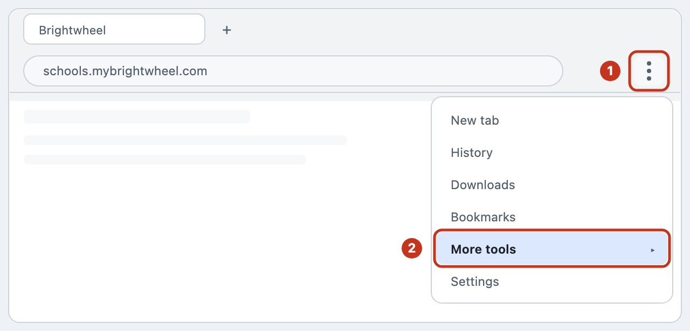
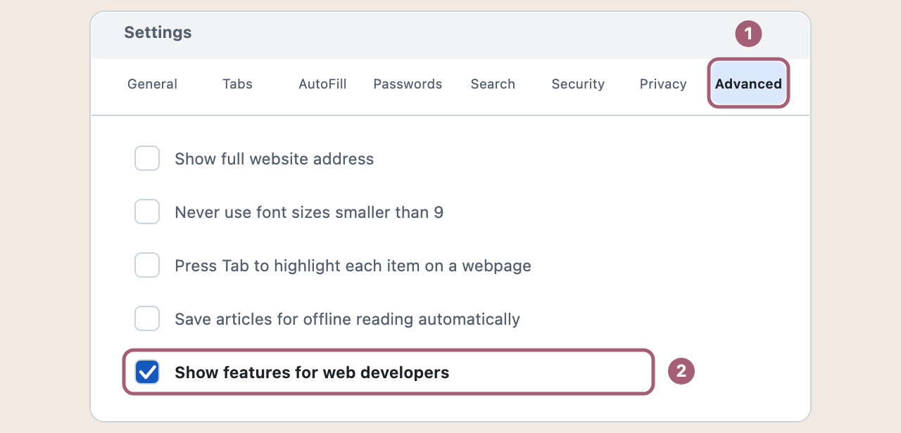
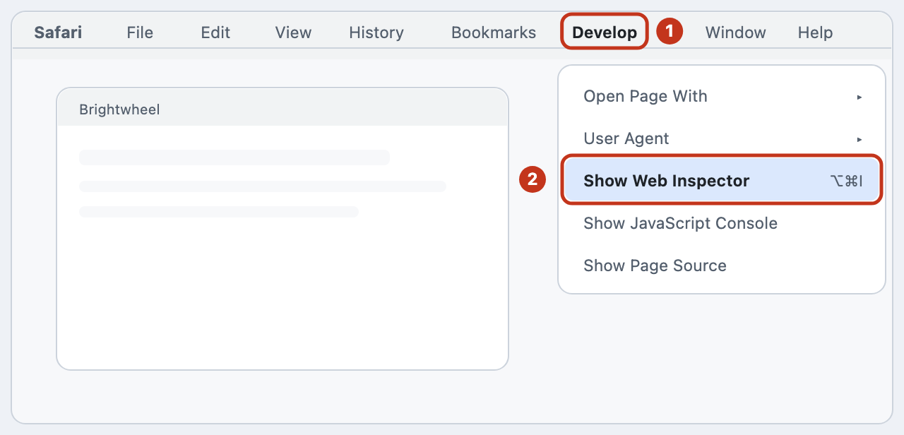
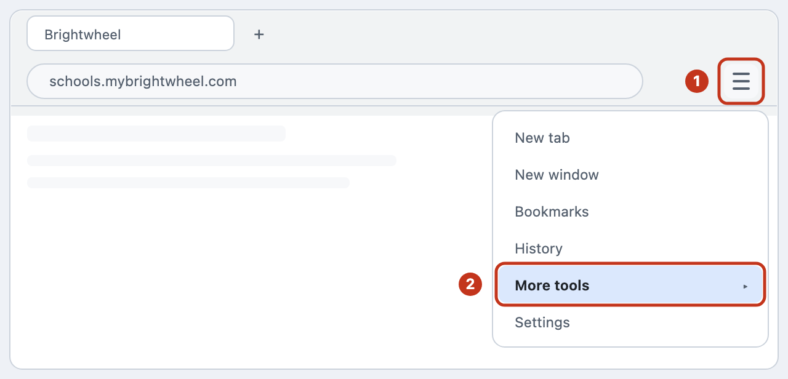

# Finding the one value, with pictures

Step 1 of the setup assistant asks you to copy one value out of your browser. It is the
only fiddly part of this whole tool, and it is fiddly because browsers hide it: the place
it lives is meant for people who build websites, not for people using them.

This page shows you exactly where to click, for **Chrome or Edge**, **Safari** and
**Firefox**. The setup assistant shows the same pictures — open step 1 and press *Show me
pictures of these steps* — so you only need this page if you would rather read it
somewhere else, or print it.

> **Every picture here is a drawing, not a photograph.** Nothing on this page came off
> anybody's screen. The value shown is invented: it decodes to the words
> "ExampleOnly-NotARealValue" and its second half is all zeros, which no real one is. No
> real session, no real child and no real school appears anywhere in this project.

---

## First, why any of this

Brightwheel checks who you are with a small piece of text your browser keeps after you
sign in — a **cookie**. Its name is `_brightwheel_v2`. Handing that one value to this tool
is how the tool proves to Brightwheel that it is you, so that it can fetch **your own**
children's photos.

That means **you never type your Brightwheel password into this tool**. You sign in on
Brightwheel's real website, in your own browser, exactly as you always do — including the
6-digit code they send you — and then copy one value across.

The value is stored on your own computer, in a file only you can open: other people's
accounts on the computer cannot, though an administrator of it can, and on Windows the
protection is weaker ([what this tool cannot protect you from](../README.md#what-this-tool-cannot-protect-you-from)).
It is not your password, and it expires. If you ever think it has got out, sign out of Brightwheel
everywhere from their website, and change your password. That should end the old value;
Brightwheel does not document how quickly.

---

## Chrome or Edge

*Opening the developer tools in Chrome or Edge.*

1. On the Brightwheel tab, click the three dots at the top right.
2. Point at **More tools**, then click **Developer tools** in the list that opens.

— Quicker: press F12, or Option + Cmd + I on a Mac. A panel appears.

*Finding the value in Chrome or Edge.*

1. Click **Application** along the top of the new panel.
2. Click **Cookies** on the left, then your school’s address underneath it.
3. Find the row named `_brightwheel_v2` and copy what is in its **Value** column.

— The value is long. Click it, select all of it, then copy.

---

## Safari

Safari hides the whole thing until you turn it on, which is the one dead end nobody
guesses their way out of. Do this first, once.

*Safari hides the developer tools until you turn them on.*

1. Safari menu → **Settings** → the **Advanced** tab.
2. Tick **Show features for web developers**, then close Settings.

— A new **Develop** menu appears in the bar at the very top of your screen.

*Opening the Web Inspector in Safari.*

1. Click **Develop** in the bar at the very top of your screen.
2. Choose **Show Web Inspector**. A panel appears inside the window.

— Quicker: press Option + Cmd + I.

*Finding the value in Safari.*

1. Click **Storage** along the top — Safari calls it that, not Application.
2. Click **Cookies** on the left, then your school’s address underneath it.
3. Find the row named `_brightwheel_v2` and copy what is in its **Value** column.

— The value is long. Click it, select all of it, then copy.

---

## Firefox

*Opening the developer tools in Firefox.*

1. On the Brightwheel tab, click the three lines at the top right.
2. Point at **More tools**, then click **Web Developer Tools**.

— Quicker: press F12, or Option + Cmd + I on a Mac.

*Finding the value in Firefox.*

1. Click **Storage** along the top — Firefox calls it that, not Application.
2. Click **Cookies** on the left, then your school’s address underneath it.
3. Find the row named `_brightwheel_v2` and copy what is in its **Value** column.

— The value is long. Click it, select all of it, then copy.

---

## Then paste it

Go back to the setup assistant, paste what you copied into **Paste the value here**, and
press **Connect**. If it worked, step 1 turns green and your children appear.

You can paste it in any of the shapes a browser might hand you — the bare value, or the
whole `name=value` pair, or a whole line of several cookies. The tool picks out the one it
needs and ignores the rest.

## If it does not work

**"That does not look like a Brightwheel session."** You have most likely copied the row's
*name* rather than its *Value*, or copied from the wrong row. Go back and copy the Value
column of the row named `_brightwheel_v2`.

**There is no `_brightwheel_v2` row.** Two usual causes. Either you are not signed in on
that tab — sign in at schools.mybrightwheel.com first, then reopen the panel — or the
left-hand list is showing a different website's cookies; click your school's address under
**Cookies**, not another entry.

**The list is empty.** The panel shows cookies for whatever tab is in front. Make sure the
Brightwheel tab is the one showing, then press F5 to reload it.

**It worked yesterday and not today.** These values expire, and signing out of Brightwheel
should end them early. Fetch a fresh one the same way and paste it again; nothing you have
already saved is affected.

**Your browser is not one of the three above.** Most browsers are Chrome underneath (Brave,
Opera, Vivaldi, Arc), so follow the Chrome steps. The panel is nearly always opened with
F12, and the cookies are under a tab called either **Application** or **Storage**.
