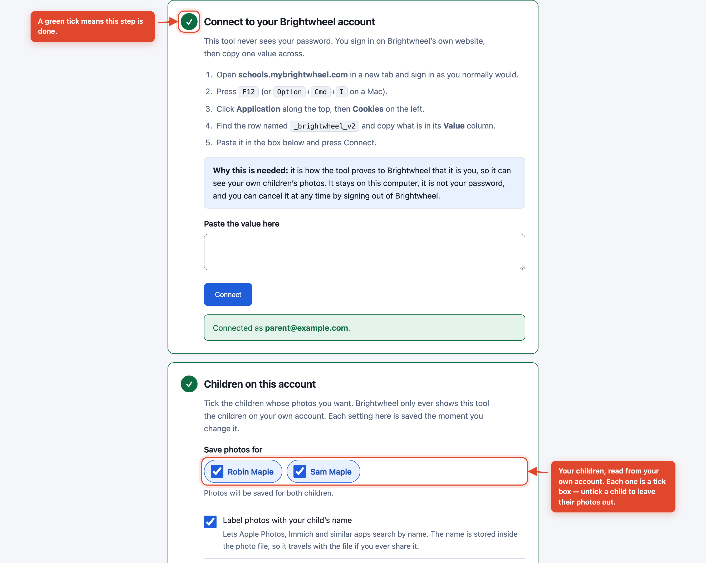
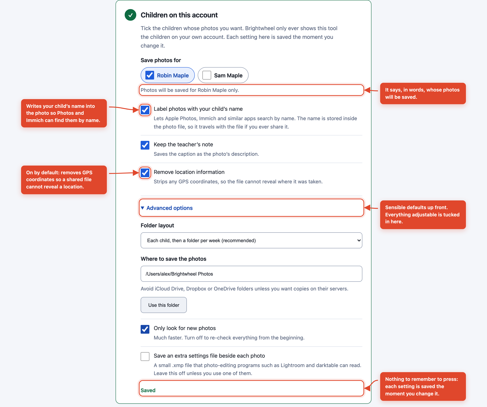
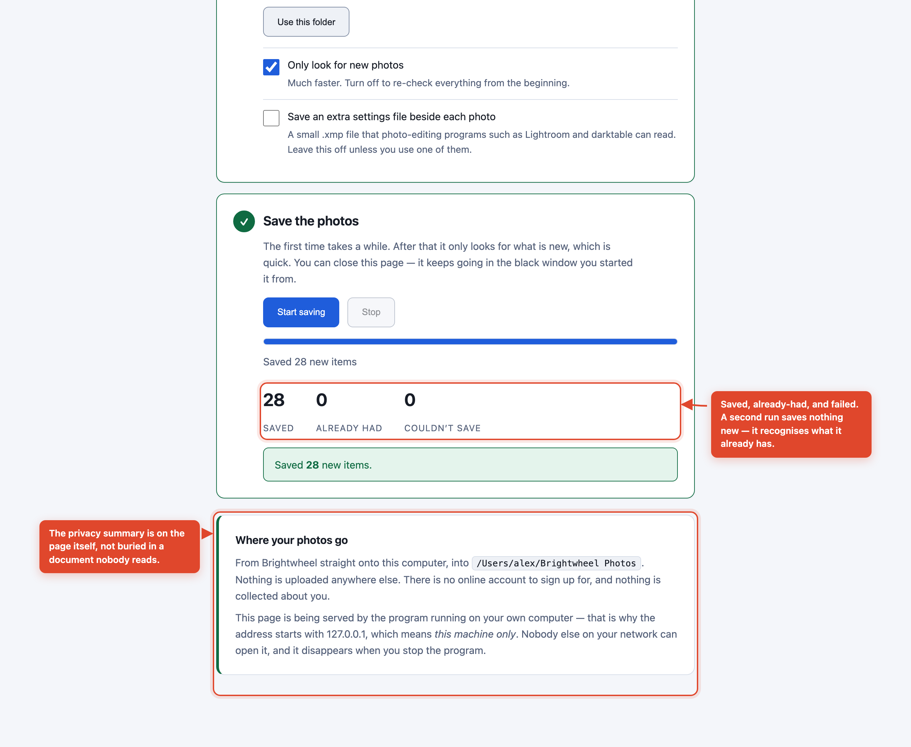
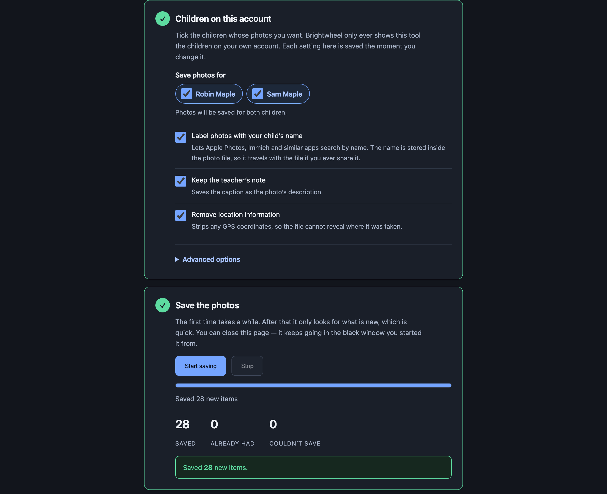

# The complete guide

For parents who have never used a terminal before. Take it one step at a time — there is
nothing here you can break.

> Every screenshot below is from a test run with **invented children**. Robin and Sam Maple
> do not exist. No real child appears anywhere in this project.

---

## Before you start

You need **Node.js** — free software that runs this tool.

1. Go to [nodejs.org](https://nodejs.org) and download the version marked **LTS**.
2. Open it and click through the installer.

Then open a terminal:

- **Mac** — press `Cmd` + `Space`, type `Terminal`, press Enter.
- **Windows** — press the Start button, type `PowerShell`, press Enter.

A window with text in it appears. You type commands here and press Enter.

---

## Step 1 — Start the setup assistant

Type this and press Enter:

```sh
npx brightwheel-archive setup
```

The first time, it asks to download the tool. Say yes. Then it prints a link like
`http://127.0.0.1:52341/?token=...`.

**Copy that whole link and paste it into your browser.** You will see this:


> **Why the odd-looking link?** `127.0.0.1` means *this computer*. The page is not on the
> internet — nobody else can open it. The `token` is a one-time password so that other
> programs on your computer cannot open it either.

Leave that black window open while you work. Everything happens inside it, and closing it
stops the tool.

---

## Step 2 — Connect your account

This tool never asks for your password. Instead you sign in on Brightwheel's real website
and copy one value across.

1. Open a new browser tab, go to **schools.mybrightwheel.com**, and sign in as normal
   (including the 6-digit code they send you).
2. Press **F12** on Windows, or **Option + Cmd + I** on a Mac. A panel opens.
3. Click **Application** along the top, then **Cookies** on the left, then the
   `schools.mybrightwheel.com` entry.
4. Find the row named **`_brightwheel_v2`** and copy what is in its **Value** column. It is
   a long jumble of letters and numbers.
5. Paste it into the box and press **Connect**.

The page writes those five steps for the browser you are reading it in, so if what is on
screen differs from the list above, follow the screen. Firefox and Safari call the panel
**Storage** rather than **Application**, and Safari hides it until you turn it on: Safari
menu → **Settings** → **Advanced** → tick **Show features for web developers**.

If it worked, the step turns green and your children appear, each with a tick box:



> **Is it safe to copy that value?** It is a temporary pass that says you are already
> signed in. It is stored on your computer only, in a file only you can open, and sent
> only back to Brightwheel. It is not your password, and it expires.
>
> **If you ever think it has leaked**, sign out of Brightwheel everywhere from their
> website. That makes the old value useless immediately.

---

## Step 3 — Choose what you want

The defaults are sensible; you can press **Start saving** without changing anything.

**Which children.** Every child on your account starts ticked. Untick a child to leave
their photos out — for instance if one of them has left the nursery, or you only want a
single child in this folder. The line underneath the names always says, in words, whose
photos will be saved: *Photos will be saved for both children.*, or *Photos will be saved
for Robin Maple only.*

**If you untick every child**, that line turns red and reads *Tick at least one child.
Photos are only saved for the children you tick.*, and **Start saving** goes grey until you
tick someone. Nothing is stored while it says that — "nobody" is not a choice the tool can
save — so your previous choice is what a run started from the terminal would still use.

If every child you had ticked has since left your account, all the boxes come back ticked
rather than none. A choice that names nobody is out of date, not a decision to save
nothing.

**Nothing to remember to press.** Each setting is saved the moment you change it, and a
small *Saved* appears to say so. The one exception is the folder, because a half-typed
path is not a folder yet: it is saved when you leave that box, press Enter, or press
**Use this folder**. When you press **Start saving**, what is on the screen is what runs.
Open **Advanced options** for the folder, the layout and the rest.



| Setting | Default | What it means |
|---|---|---|
| Save photos for | **All your children** | Untick a child to leave their photos out. A child who joins your account later is included automatically as long as everyone is ticked. |
| Label photos with names | **On** | Writes inside the photo file: your child's name, the nursery's name, whoever posted it, and the teacher's note — which usually names all three in one sentence. That is what lets Apple Photos, Immich and similar apps search by name, and it means all of it travels with the file if you ever share it. Turn it off and nothing inside the file says who or where. |
| Keep the teacher's note | **On** | Saves the caption as the photo's description. It only applies while **Label photos with names** is on, because a note names people. |
| Remove location information | **On** | Strips GPS coordinates so a shared photo cannot reveal where it was taken. This one needs ExifTool: without it nothing inside the photo can be changed, so any coordinates stay — and the run tells you so. |
| Folder layout | Child, then week | Or one folder per week with all children together, or one folder per week with a folder for each child inside it. |
| Where to save the photos | `~/Brightwheel Photos` | **Avoid iCloud Drive, Dropbox or OneDrive folders** unless you want copies on their servers. |
| Only look for new photos | **On** | Much faster. Turn off to re-check from the beginning. |
| Save an extra settings file beside each photo | **Off** | A small `.xmp` file that photo-editing programs such as Lightroom and darktable can read. Leave it off unless you use one of them. |

**The names switch changes the photo, not the `.json` file beside it.** That small file
always records your child's name and Brightwheel id, the nursery, the teacher's note and
who posted it, whichever way the switches are set — it is the record that keeps the archive
readable in twenty years. It stays on your computer when you share a photo, which is the
point of it; it is also the reason not to paste one into a public bug report.

> **From the terminal instead:** `npx brightwheel-archive children` lists your children with
> the id Brightwheel uses for each, and `npx brightwheel-archive run --child "Sam Maple"`
> (or `--child <id>`, repeated for several) saves only those children's photos for that one
> run. It does not change the choice you made on this page.

---

## Step 4 — Save the photos

Press **Start saving**. The first run takes a while — it fetches everything. Later runs
take seconds, because it only looks for what is new. While it is working the settings above
are locked and the page says so, and the line under the buttons tells you what it is doing:
*Looking for Robin Maple's photos*, then *Looked through 40 of 312 updates for Robin
Maple*, then *Saving 2026-09-18_093214_7f3a9b21.jpg*. You can close the page — the run
keeps going in the black window, and opening the link again picks the progress back up.



The tool follows your system appearance, so it looks right in dark mode too:



- **Saved** — new photos copied to your computer.
- **Already had** — recognised as ones you have. This is why a second run is quick.
- **Couldn't save** — could not be fetched. Press **Start saving** again later; it picks up
  where it stopped.

At the end it says *Saved 28 new items.*, or, on a day when there is nothing new, *You are
up to date — there were no new photos to save.*

### Stopping part-way

You can stop a run whenever you like, and nothing already saved is lost: those photos are
on your computer, and the tool writes down what it has before it stops, so the next run
carries on from there instead of starting again.

- **The Stop button**, beside *Start saving*. It is grey until a run is going. Press it and
  it reads *Stopping…* while the photo being saved is finished — a large video can take a
  moment — and then the page says *Stopped. 12 item(s) saved so far are kept; run again to
  carry on where it left off.* Press **Start saving** whenever you want to continue.
- **`Ctrl` + `C` in the black window** closes the setup assistant. If a run is going it is
  stopped first, in exactly the way the Stop button does, so the window takes a moment to
  close.
- **`Ctrl` + `C` while `npx brightwheel-archive run` is going** (the terminal-only way to
  save photos, below) prints *Stopping after the current photo…*, finishes that photo, and
  ends with *Run the same command again to carry on where it left off.*

Press `Ctrl` + `C` a second time and it stops on the spot. The photos you already have are
safe, but the last few may not have been written down yet, so the next run fetches those
again and can leave you a second copy of a photo or two, named `…-2.jpg`.

---

## What you end up with

```
Brightwheel Photos/
├── archive.json                                   ← the list of what has been saved
└── Robin Maple/
    └── 2026-W38/
        ├── README.md                              ← what this week is, in plain English
        ├── 2026-09-18_093214_7f3a9b21.jpg         ← the photo, date first so it sorts
        └── 2026-09-18_093214_7f3a9b21.jpg.json    ← the date, the note, who posted it
```

`2026-W38` means the 38th week of 2026. Weeks run Monday to Sunday. The folder's
`README.md` spells out the actual dates.

The `.json` file means the archive still makes sense in twenty years, with or without this
tool.

`archive.json` is the tool's own list of what it has already saved. It is how the next run
knows what is new, and it is what lets a stopped run be carried on. Every path in it is
written with forward slashes on every computer, so the folder still reads correctly if you
move it between a Mac, a Windows PC and Linux.

---

## Doing it automatically every day

### Mac or Linux

```sh
crontab -e
```

Add this line, save and close. It runs at 7pm daily:

```
0 19 * * *  /usr/local/bin/npx brightwheel-archive run
```

Use the full path to `npx`, not a bare `npx`: a scheduled job like this one looks for
programs in only a few places and usually does not find it. Type `which npx` in your
terminal and paste what it prints — on a Mac with Homebrew it is often
`/opt/homebrew/bin/npx`.

### Windows

Open **Task Scheduler** → **Create Basic Task** → Daily → Start a program:

- Program: `npx.cmd`
- Arguments: `brightwheel-archive run`

The `.cmd` matters. Task Scheduler starts the program itself rather than going through a
command prompt, so a bare `npx` sends it looking for `npx.exe`, which does not exist, and
the task fails at once with *the system cannot find the file specified*. Setting Program to
`cmd.exe` and Arguments to `/c npx brightwheel-archive run` works just as well.

### Docker

Only if you already use Docker — it is not the easy path, and there is no ready-made image
to download. You build one yourself, once, from a copy of this project:

```sh
docker build -t brightwheel-archive .
```

Then, each time:

```sh
docker run --rm \
  --user "$(id -u):$(id -g)" \
  -v ~/.config/brightwheel-archive:/config \
  -v ~/Brightwheel\ Photos:/photos \
  brightwheel-archive run --dir /photos
```

`--dir /photos` is what sends the photos to the folder you mounted; without it they are
written inside the container and go when it does. (The image has a built-in command that
would supply `--dir` for you, but naming `run` at the end replaces it, so once you name
`run` you have to name `--dir /photos` too.) `--user` runs the container as you, which
is what lets it read your session file and write into your folder on Linux; Docker Desktop
on a Mac or Windows does not need it and is not harmed by it. The `/config` line above is
the Linux location — on a Mac the session lives in
`~/Library/Application Support/brightwheel-archive`, and `npx brightwheel-archive where`
prints the exact folder to mount.

---

## When something goes wrong

Run this first. It checks everything and **never prints your session** — only a short
fingerprint of it:

```sh
npx brightwheel-archive doctor
```

It is safe to paste into a bug report, with one thing to glance at first: it prints the full
paths to your settings and photos folders, and on most computers those contain the name of
your user account. Change that to something else if you would rather not show it.

| Message | What to do |
|---|---|
| *Your Brightwheel session has expired* | Normal — they expire. Run `setup` again and paste a fresh value. If it happens in the middle of a run, everything saved up to that point is kept and the next run carries on from there. |
| *That does not look like a Brightwheel session* | What you pasted was not a session value at all — most often a whole line of cookies copied from somewhere else. Go back to the `_brightwheel_v2` row and copy only what is in its **Value** column. |
| *Your Brightwheel session has expired* — **straight after pasting a fresh value** | Probably not expired: the tool cannot tell a wrong value from an old one, so anything Brightwheel rejects is reported this way. The usual cause is copying the **Name** column (`_brightwheel_v2`) instead of the **Value** column beside it — the value is a long jumble of letters and numbers, not a word. Check that, then paste again. |
| *Tick at least one child* | Every child is unticked. **Start saving** stays grey until you tick one — the tool will not run with nobody chosen. |
| *That is a temporary folder, and your computer deletes those automatically* | The folder you typed is one the computer empties by itself, so it is refused rather than losing your photos months from now. Choose somewhere permanent, such as `~/Brightwheel Photos`. |
| *This folder looks like it is inside Dropbox* (or iCloud Drive, OneDrive, Google Drive) | A warning, not a refusal: the folder is saved and the run will use it. It means a copy of every photo goes to that company as well. Fine if you meant it. |
| *Could not reach the tool* | The black window it was started from has been closed. Start it again with `npx brightwheel-archive setup` and open the new link. |
| *Looked through 40 of 312 updates* | Not a problem — this is the progress line. Brightwheel counts updates of every kind, so that total includes check-ins, naps and notes. It is not a number of photos, and most of them are not photos. |
| *No children found on this Brightwheel account* | Make sure you signed in as the parent account, not a staff one. |
| *ExifTool is not installed* | Harmless: every photo is still saved, and the dates and names go into the `.json` file beside it rather than inside it. Writing them *inside* needs the tool's own bundled copy, which comes with it automatically — so this message usually means the install skipped optional packages. Installing ExifTool on your computer by hand will **not** fix it; the tool only ever uses its own copy. Reinstalling normally (`npm install -g brightwheel-archive`, without `--omit=optional`) will. |
| Photos in the wrong week | Please open an issue, and include three things: the photo's file name (`2026-09-18_093214_7f3a9b21.jpg`), the week folder it landed in (`2026-W38` — just that part, not the folder above it, which is your child's name), and the single line from the `.json` file beside it that starts `"capturedAt"`. That is everything needed to diagnose it, and none of it names anybody. **Please do not attach the whole `.json` file.** It also holds your child's name and Brightwheel id, the nursery's name, the teacher's note and who wrote it — and an issue tracker is a public web page that search engines index. |

---

## Questions people ask

**Will this get my account into trouble?**
It requests one page at a time with a pause between, which is gentler than scrolling the
website. It reads only your own data. We cannot promise anything on Brightwheel's behalf,
and their terms are theirs to interpret — but nothing here is aggressive.

**Does it delete anything from Brightwheel?**
No. It only reads. Nothing is ever changed or removed from your account.

**My child is in two nurseries / I have two accounts.**
Run it once per account, pointing `--dir` somewhere different each time.

**Can I use this for a child who isn't mine?**
No. Brightwheel only shows your own account's children. That is enforced by them, not by
us, and it cannot be worked around with this tool.
