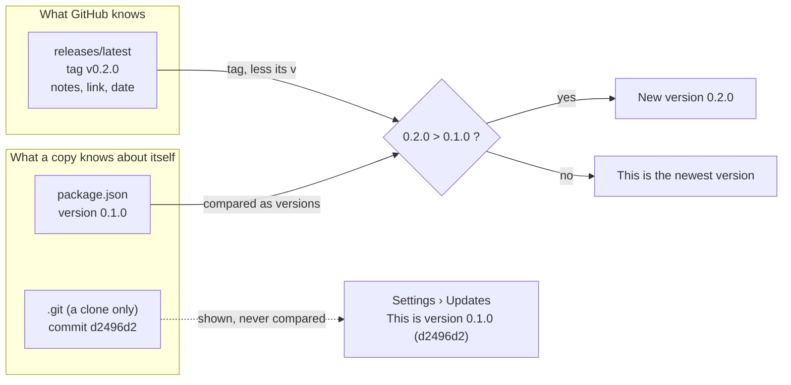
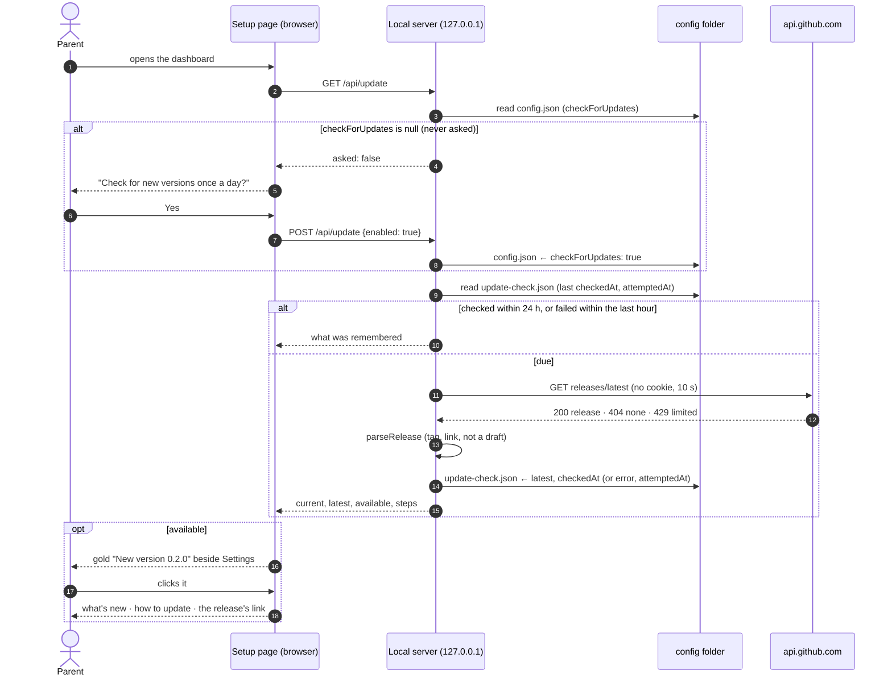
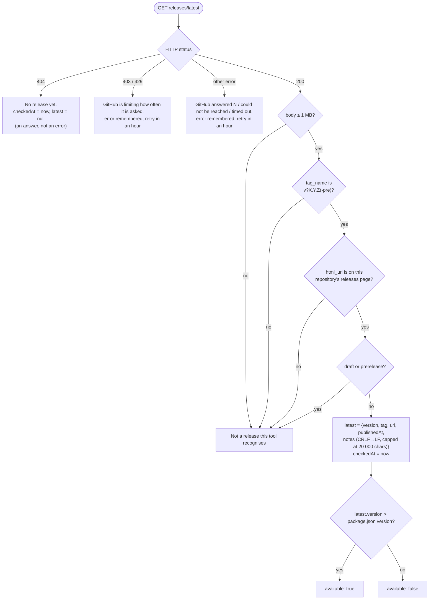

# How the update check works

[UPDATING.md](UPDATING.md) tells a parent how to update. This is the other side: how the
running page finds out that there is something to update to, why it is built the way it is,
and what a release has to consist of for it to keep working. The code is
`packages/care-album-saver/src/updates.ts` (the check), `src/version.ts` (what this copy is,
and how it was installed) and the `/api/update` route in `src/web/server.ts`.

## The chicken and the egg

A copy of the tool cannot know, when it is built, what the newest release is: the newest
release is the one that does not exist yet. And a copy cannot reliably know even its own
release hash — an `npm install` has no `.git`, a ZIP download has no `.git`, and the commit a
clone sits on may be days past the last tag.

So the mechanism never compares hashes, and nothing about the future is baked into a build:

- A copy knows exactly one thing about itself for certain: the `version` field of its own
  `package.json`. That field is part of the release — bumping it is what makes a release.
- If the copy is a clone, it also reads the commit it is on straight out of `.git` (`HEAD`,
  then the branch it names, loose or packed — no `git` process is started). That commit is
  shown to the person ("This is version 0.1.0 (d2496d2)") and used for nothing else. An
  installed copy shows the version alone.
- "What is newest" is asked of GitHub at run time: `GET /repos/ip2k/care-album-saver/releases/latest`.
  The answer's `tag_name` is the release's name — `v0.2.0` — and the tag is the only thing
  compared, as a version, against the copy's own. The release's page link and notes come
  along for the person to read.

The tag is what names a release, `package.json` is what a copy carries, and the comparison
between them is the whole test. There is no moment at which anything has to know a hash
before it exists.

## What a release must consist of

Because the check compares the tag with `package.json`, a release is three things done
together, or the check tells parents the wrong thing:

1. **Bump `version`** in `packages/care-album-saver/package.json` (and the root
   `package.json`), and move the `## [Unreleased]` entries of `CHANGELOG.md` under a
   `## [X.Y.Z] — date` heading. Commit that on `main`.
2. **Tag that commit** `vX.Y.Z` (the `v` is optional to the parser; the number must be
   `major.minor.patch`, with an optional `-pre.N` suffix).
3. **Create the GitHub release** on that tag, with the CHANGELOG section as its body. That
   body is what the page shows under "What's new". Drafts and pre-releases are ignored by
   the check, so a pre-release can be published without telling every parent about it.

Publishing the release is also what puts it on npm: `.github/workflows/release.yml` runs on
it, refuses a tag that does not match `packages/care-album-saver/package.json` or is not on
`main`, builds and tests, and runs `npm publish`. A pre-release goes to npm's `next` tag, so
`@latest` never picks it up. Nothing is bumped by the workflow; step 1 is still yours.

### One-time setup for npm

The workflow has no npm token. It uses [trusted publishing](https://docs.npmjs.com/trusted-publishers):
npm accepts this repository's GitHub Actions identity instead, and records which commit
built each version (provenance). Before the first automated release:

1. A trusted publisher is configured per package, so the package must exist first: publish
   the first version by hand (`pnpm build`, copy `README.md` into
   `packages/care-album-saver/`, then `npm publish --access public` there).
2. On npmjs.com, the package's **Settings → Trusted Publisher → GitHub Actions**:
   organization or user `ip2k`, repository `care-album-saver`, workflow `release.yml`,
   environment `npm`.
3. In this repository's **Settings → Environments**, create `npm`. Restricting it to tags,
   or adding a required reviewer, makes a publish wait for that too.

What goes wrong if the three come apart: a tag without the bump means every copy sees
"new version" for a release it already has, forever; a bump without a tag means nobody is
told. The first is loud and gets fixed; the second is silent, so the release process is
the tag.

## One check, start to finish

Two things in that picture are deliberate and easy to get backwards:

- **The server asks, not the browser.** The page's Content-Security-Policy is
  `connect-src 'self'`; nothing in the page can reach GitHub. The request is made by the
  local Node process, from the machine's own address, with no cookie, no token and no
  User-Agent of its own (Node's default). That is also why the check runs only while the
  setup page is open: the daily run never asks.
- **Nothing is sent before a yes.** `checkForUpdates` is `null` until the parent answers;
  only `/api/update` can change it — a settings patch cannot, by construction (the patch
  is a whitelist of eight other fields). The answer is a switch in Settings afterwards,
  with "Check now" beside it.

## What each answer from GitHub becomes

The link check matters more than it looks: the page puts `html_url` into an `<a href>`, and
GitHub's API is a third party. Parsing the address first means `..` segments,
`%2e%2e`, credentials, a query or a fragment cannot walk it off this repository's releases
page. The notes are rendered as text nodes only — a heading becomes a bold line and a bullet a
bullet, and nothing in them is ever parsed as HTML. The "how to update" commands are never
taken from the response at all; see below.

## How often, and what is remembered

| | |
|---|---|
| Automatic check | at most once every 24 hours, and only when the page asks `/api/update`: when it loads, and when the switch or "Check now" is used |
| After a failure | not retried for an hour, and the last good answer is kept and shown |
| "Check now" | at most once a minute |
| Timeout | 10 seconds |
| Response size | 1 MB at most; notes 20 000 characters at most |
| Remembered in `update-check.json` | `checkedAt` (last answer), `attemptedAt` (last try), `latest` (the release, re-validated on every read because the file can be edited by hand), `error` |
| Remembered in `config.json` | `checkForUpdates`: `null` never asked, `true`, `false` |
| Sent to GitHub | the request line and Node's default headers. Nothing about the account, the children, the archive or the settings |
| Under test | `CARE_ALBUM_NO_UPDATE_CHECK=1` (set by `scripts/test-env.js`) makes the real network refuse; tests and the demo pass a stand-in `fetch` |

## "How to update" knows how this copy was installed

The steps shown after the notice depend on how the copy got onto the computer, and that is
worked out from where its own files are — nothing is asked of the network or of another
program. `installKind()` in `src/version.ts`:

| Where `package.json`'s folder is | Kind | Steps say |
|---|---|---|
| a folder with the production marker file | `production` | `cd` to the checkout it was deployed from, `git pull`, `node scripts/deploy.js` |
| inside a container (`/.dockerenv` or `/run/.containerenv`) | `docker` | `git pull`, `docker build` |
| under `…/_npx/…` | `npx` | `npx care-album-saver@latest setup` |
| under `…/pnpm/dlx/…`, `…/dlx-…`, `…/bunx-…` | `pnpm-dlx`, `yarn-dlx`, `bunx` | the same, with that tool |
| under `lib/node_modules` or `npm/node_modules` (Windows) | `npm-global` | `npm install -g care-album-saver@latest` |
| under `pnpm/global`, `yarn/global`, `Yarn/Data/global`, `.bun/install/global` | `pnpm-global`, `yarn-global`, `bun-global` | that tool's global install |
| under any other `node_modules` | `npm-local` | `npm install care-album-saver@latest` in that project |
| the repository has a `.git` | `git` | `git pull`, `pnpm install`, `pnpm build` |
| the repository files without `.git` (a ZIP) | `download` | replace the folder from the release's source ZIP, then build |
| none of the above | `unknown` | a link to the guide, no guessing |

The order matters in one place: a `node_modules` check comes before the `.git` check, because
a package installed inside somebody's own git project would otherwise look like a clone of
this one.

The steps are built from that kind and the copy's own folder — never from anything GitHub
sent — so a hostile release body cannot put a command in front of the parent. The commands
are shown in a block with a "Copy" button; the folder is written the way a person reads it
(`~/…`).

## Edge cases, and what the mechanism does with them

- **A clone on `main` after the version bump but before the tag** compares equal to the
  release when it lands, and is told nothing. Right: it already has that code.
- **A clone behind the bump** is told the release exists, and the steps are `git pull`.
- **A copy with no readable `package.json`** reports `0.0.0`, which every release is newer
  than, so it is told to update. Right: it is broken.
- **A fork** carries this repository's name in `REPOSITORY`, so a fork's users are told about
  *this* project's releases unless the fork changes that constant. Deliberate: the alternative
  is guessing the fork's remote, and a fork that wants its own releases is a one-line change.
- **A release whose tag is not a version** (`latest`, `nightly`) is "not a release this tool
  recognises" and nothing changes; the last good answer stays.
- **The check is off**: `/api/update` reports what it remembered but sends nothing; "Check
  now" answers 409 until it is switched on.

## Where it is tested

`test/updates.test.js`: version comparison including pre-releases; every branch of
`parseRelease` (wrong repository, `..` segments, credentials, drafts, pre-releases, huge
notes); the 24-hour, 1-hour and 1-minute throttles with a counting stand-in for GitHub; 404
as an answer; the network refused under test; nothing sent before a yes or after a no; the
settings patch unable to switch it on; fourteen install paths to their kind; the steps for
every kind; the commit read from loose refs, packed refs, a detached HEAD and a worktree.
`scripts/demo.js` serves a pretend release (`v9.9.0`) so the whole flow can be seen without a
real one, and `--install <kind>` previews the steps for any way of installing.
